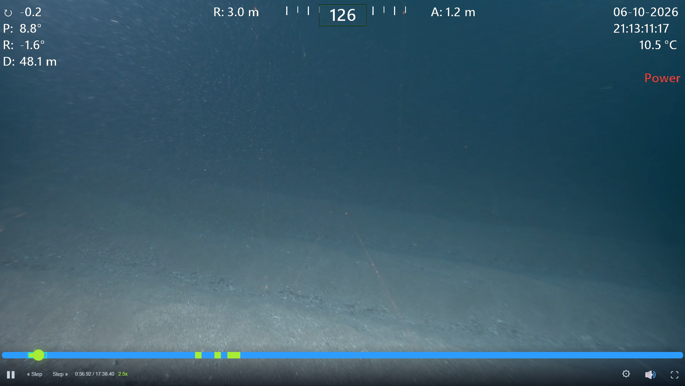

# MARP Video Player

<p align="center">
  A <strong>frame-accurate</strong> video player for the browser, built on WebCodecs.<br>
  Real reverse playback, exact frame stepping, and no dependencies to install.
</p>

<p align="center">
  
  
  
  
  
</p>

<table width="100%">
  <tr>
    <td align="center" bgcolor="#03101f">
      <br>
      
      <br><br>
    </td>
  </tr>
</table>

> **Every frame counts.**
> Built for scientific video review, where identifying an organism depends on the exact frame it appeared in — and on being able to step back to it, reliably, as many times as it takes.

This is a component of the [MARP platform](https://github.com/MarineAppliedResearch/MARP), a self-hosted system for ecological data, video workflows, and reporting. It works standalone in any browser application.

---

## Why this exists

A plain `<video>` element cannot play backwards. `playbackRate` rejects negative values, so reviewing footage in reverse means repeatedly seeking backwards and hoping the browser lands near the intended frame — and against HLS it usually does not, because seeks snap to whatever the container's group-of-pictures structure allows.

For ecological review that is not a cosmetic problem. An analyst who spots something at a particular moment needs to return to *that frame*, not to somewhere in its neighbourhood.

This player fetches media itself, demuxes the container, decodes with [WebCodecs](https://developer.mozilla.org/en-US/docs/Web/API/WebCodecs_API), and renders to a canvas. Holding decoded frames means it can present any of them on demand — forwards, backwards, or one at a time.

## Screenshots

<!--
    Drop screenshots into images/ with these exact filenames and they will
    appear here. Captions describe what each one should show; adjust the wording
    to match whatever you actually capture.
-->

ROV survey footage playing at 2.5x. The telemetry along the top — heading,
pitch, roll, depth, range, altitude, temperature, and the real-world timestamp
observations are synced to — is burned into the video itself.

The scrub bar shades each unit as it is fetched and decoded, so an analyst can
see what will play instantly and what still has to be pulled. That is what makes
stepping backwards through a sequence feel immediate rather than like a series
of seeks.



## What you get

| | |
| --- | --- |
| **Frame-accurate seeking** | Land on the frame you asked for, not the nearest keyframe |
| **True reverse playback** | Negative playback rates, decoded properly rather than simulated by seeking |
| **Frame stepping** | Forward and back with no cumulative drift |
| **Variable speed** | Without timing artefacts |
| **Multiple sources** | Local files, plain URLs, and Jellyfin by transcode or Direct Play |
| **Native host embedding** | A message bridge for WebView2 and similar hosts |
| **One file** | The bundle carries the engine, interface, stylesheet, and logo |

---

## Install

```bash
npm install github:MarineAppliedResearch/marp-video-player
```

Or download a build from `dist/` and drop it into your project.

## Use it

### As an ES module

The bundle is fully self-contained — `mp4box` and the player interface are compiled in, so there is nothing else to install and no import map to configure.

```html
<div id="player" style="width: 960px; height: 540px"></div>

<script type="module">
  import { createMarpVideoPlayer } from './dist/marp-video-player.js';

  const player = createMarpVideoPlayer(document.getElementById('player'));
  await player.loadUrl('https://example.org/dive-165.mp4');
</script>
```

With a bundler, the package name works the same way:

```js
import { createMarpVideoPlayer } from 'marp-video-player';
```

### As a plain script tag

No modules, no build step. The bundle attaches `window.MarpVideoEngine`:

```html
<script src="dist/marp-video-player.iife.js"></script>
<script>
  const player = MarpVideoEngine.createMarpVideoPlayer(document.getElementById('player'));
</script>
```

### Engine only, bring your own interface

`createMarpVideoEngine` gives you decoding, scheduling, and frame presentation with no user interface, for applications that draw their own controls.

```js
import { createMarpVideoEngine, UrlMediaSource } from 'marp-video-player';

const engine = await createMarpVideoEngine(canvas, {
  mediaSource: new UrlMediaSource({ url }),
});
engine.currentTime = 42.0;
engine.playbackRate = -1;
engine.play();
```

---

## Two guarantees

**Nothing else to install.** The bundles have zero external imports. A consumer adds one file.

**No internet connection required.** Loading the player makes no network requests of any kind — no CDN, no web fonts, no remote assets. The logo is an inlined data URI and the interface uses system fonts. The only traffic is fetching the media you point it at.

Both matter because this runs on ships and at field sites, where connectivity is unreliable or absent.

---

## Builds

`npm run build` produces three outputs:

| File | Format | Use |
| --- | --- | --- |
| `dist/marp-video-player.js` | ESM | `import` in a browser or bundler |
| `dist/marp-video-player.iife.js` | IIFE, `window.MarpVideoEngine` | plain `<script>` |
| `dist/marp-video-player.standalone.js` | IIFE, minified | native hosts and embedded use |

The IIFE global is `MarpVideoEngine` rather than the package name, because the C# WebView2 host and the pages in `app/` depend on that name.

## Media sources

The player reads from several kinds of source, selected by the `MediaSource` implementation you hand it:

| Source | What it reads |
| --- | --- |
| `UrlMediaSource` | any HTTP URL serving an MP4 with range requests |
| `LocalFileMediaSource` | a `File` from an `<input type="file">` or a drop |
| `JellyfinDirectPlayMediaSource` | Jellyfin, streaming the original file by byte range |
| `JellyfinTranscodeMediaSource` | Jellyfin, via its HLS transcode |

`createJellyfinSource` chooses between the two Jellyfin strategies automatically.

## Public API

Twenty named exports. The main entry points:

- `createMarpVideoPlayer(container, options)` — a complete player with its interface
- `createMarpVideoEngine(canvas, options)` — engine only, given a `mediaSource`
- `attachWebView2Bridge(...)` — message bridge for native hosts
- `PLAYER_CSS` — the stylesheet, if you render the markup yourself

Generate the full reference with `npm run docs`.

## Browser support

Requires WebCodecs: **Chrome and Edge 94+**. Firefox and Safari do not yet ship the APIs this depends on.

---

## Development

```bash
npm install
npm run build        # ESM, IIFE, and standalone bundles into dist/
npm run serve        # static server on port 8099
npm test             # 140 unit tests, no dependencies
npm run docs         # JSDoc reference into docs/generated/
```

<http://localhost:8099/app/index.html> is the developer test page: the player with its full interface, plus a panel simulating a native host. Load a local file or a URL and everything runs with nothing else installed.

### In VS Code

Open the folder and use **Run and Debug** (<kbd>F5</kbd>):

| Configuration | What it does |
| --- | --- |
| Open player in browser | Rebuilds, starts the server, opens the player |
| Run unit tests | 140 tests, no dependencies |
| Run browser tests | 26 tests in a real browser |
| Build library | The three bundles into `dist/` |
| Build docs | JSDoc reference into `docs/generated/` |

All five run under the debugger, so breakpoints work.

`Install Playwright browsers` is a one-time task under **Terminal → Run Task**, needed on a new machine before the browser tests can run.

### Tests

Two tiers, both fully automated:

- **`npm test`** — unit tests against fake WebCodecs globals. No server, no network, no media. Seconds to run.
- **`npm run test:e2e`** — real browser, real decoding. Starts its own server and downloads its own test media; copy `.env.example` to `.env` first. Minutes to run, so it is not the inner development loop.

A missing prerequisite fails the run and names what to set, rather than skipping. A skipped suite looks green.

### Host integration

The player runs inside a C# WebView2 host in MARE's desktop application. `app/player.html` is the page that host loads, and `attachWebView2Bridge` carries messages between them.

Changing the bridge protocol, the `MarpVideoEngine` global name, or `player.html`'s query parameters is a breaking change for software in a different repository. See [CONTRIBUTING.md](CONTRIBUTING.md).

---

## The MARP platform

This player is one component of [MARP](https://github.com/MarineAppliedResearch/MARP), which connects ecological observations, expert interpretation, video review, machine learning, and reporting through one shared system.

| Component | Purpose |
| --- | --- |
| [MARP](https://github.com/MarineAppliedResearch/MARP) | Platform umbrella: architecture, deployment, and the component registry |
| [MARE_API](https://github.com/MarineAppliedResearch/MARE_API) | API and application backend |
| [marp-jellyfin](https://github.com/MarineAppliedResearch/marp-jellyfin) | Video server |
| [marp-inference-worker](https://github.com/MarineAppliedResearch/marp-inference-worker) | Machine-learning inference |
| **marp-video-player** | This repository |

The player has no dependency on the rest of the platform and can be embedded on its own.

## Contributing

See [CONTRIBUTING.md](CONTRIBUTING.md). Project governance is documented in the [platform repository](https://github.com/MarineAppliedResearch/MARP).

## History

Extracted from [`MARE_API`](https://github.com/MarineAppliedResearch/MARE_API), where it was developed as `video-engine/`. Commit history before the extraction is in that repository.

## License

Apache License 2.0. See [LICENSE](LICENSE), and [NOTICE](NOTICE) for third-party code compiled into the builds.

The MARP name and logo are excluded from the software license. Truthful descriptive statements such as "Built with the MARP video player" are fine; presenting a fork as an official MARP release is not.
